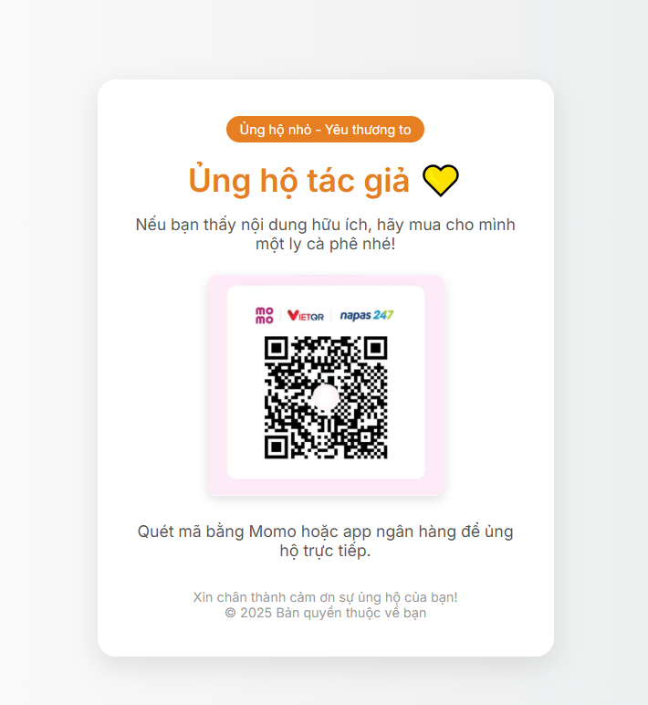

# 🎁 Donate Page Template (Trang ủng hộ cá nhân)

Đây là một mẫu **trang donate đơn giản bằng HTML** giúp bạn tạo nhanh một trang "Ủng hộ tôi" dùng mã QR Momo hoặc VietQR.  
Giao diện responsive, dễ chỉnh sửa và triển khai trên GitHub Pages.

---

## 📂 Cấu trúc thư mục

donate-page-template/
├── donate/
│ ├── index.html # File chính hiển thị nội dung
│ └── qr-momo.png # Ảnh mã QR (bạn thay bằng QR của mình)
└── README.md # File hướng dẫn

---

## 🚀 Hướng dẫn sử dụng

### 1. Sử dụng template

Nhấn nút 📎 **Use this template** ở góc phải trên GitHub → tạo repo riêng của bạn từ mẫu này.

Hoặc bạn có thể **fork** nếu muốn chỉnh sửa trực tiếp.

---

### 2. Thay mã QR cá nhân

- Dùng app ngân hàng/Momo tạo mã QR tĩnh
- Đổi tên ảnh thành `qr-momo.png`
- Thay ảnh vào thư mục `donate/`

---

### 3. Bật GitHub Pages

1. Vào **Settings → Pages**
2. Ở mục `Source`, chọn:
   - **Branch**: `main`
   - **Folder**: `/donate`
3. Nhấn **Save**

⏳ Sau vài giây, GitHub sẽ tạo link như: 
https://yourusername.github.io/donate/

---

## 🎨 Tuỳ chỉnh thêm

Bạn có thể chỉnh:
- Tiêu đề, màu sắc, font chữ
- Thêm nội dung, mạng xã hội
- Đổi ảnh, thêm nút bấm (PayPal, ZaloPay...)

---

## 📸 Giao diện mẫu

---

## ❤️ Góp ý

Nếu bạn thấy hữu ích, hãy ⭐ star repo này hoặc chia sẻ cho bạn bè!  
Mọi góp ý và pull request đều được hoan nghênh.
